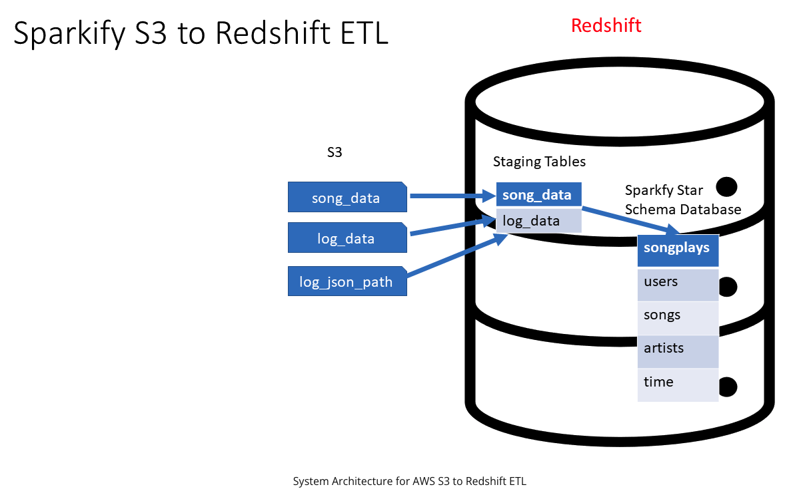
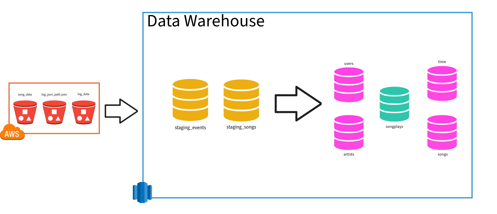
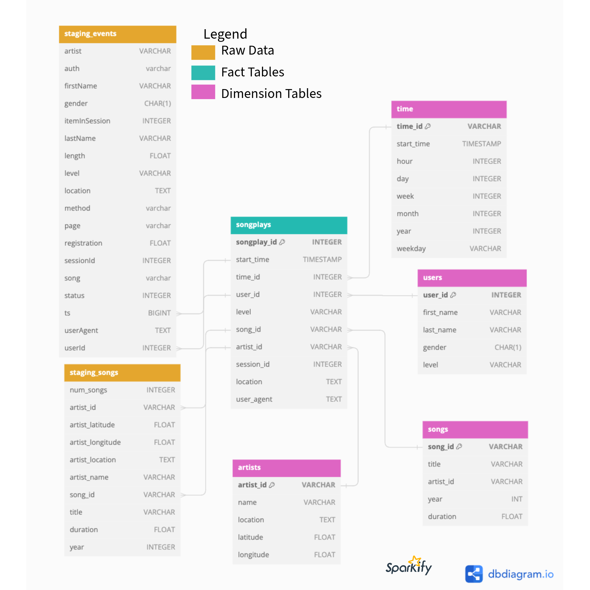

# Project 2: Data Warehouse

A music streaming startup, Sparkify, has grown their user base and song database and want to move their processes and data onto the cloud. Their data resides in S3, in a directory of JSON logs on user activity on the app, as well as a directory with JSON metadata on the songs in their app.

As their data engineer, you are tasked with building an ETL pipeline that extracts their data from S3, stages them in Redshift, and transforms data into a set of dimensional tables for their analytics team to continue finding insights into what songs their users are listening to.

## Requested Architecture

<p align="center">
  
</p>

# ETL Pipeline

An RDS cluster is spun up and data is raw data is moved from the designated S3 bucket into Redshift for staging. Staging data is then transformed as needed to be copied into appropriate Fact and Dimension tables to enable company reporting and analysis.

<p align="center">
  
</p>

## Utility and Query Files
1. `queries/sql_queries.py`: File that houses all queries for dropping and creating tables as well as copying and inserting data into tables.
2. `utils/redshift_utils.py`: A module created to house common functions to reduce amount of repeated code in main notebook.
    - `create_role`: Provisions IAM role for RDS cluster.
    - `create_cluster`: Provisions RDS cluster.
    - `execute_sql_queries`: Submits query via database connection.
    - `execute_qa_count_queries`: Executes a table count on all tables provided.
    - `execute_qa_row_queries`: Executes a row of 1 query on all tables provided. 

## Scripts
1. `scripts/create_tables.py`: Creates all tables that will be loaded by the ETL process.
2. `scriptsetl.py`: Runs the ETL process of transferring and copying data from S3 into Redshift tables.


# Tables
Below is an ERD representing the relationship between all tables created as part of the ETL process.

<p align="center">
  
</p>

## Staging

1. `staging_events`: All log data from Sparkify.
2. `staging_songs`: All song data from Sparkify.

## Dimensional Model (DIMM)
### Facts
1. `songplays`: A table with all song plays by users on Sparkify.

### Dimensions
1. `users`: A table for all Sparkify users.
2. `artists`: A table for all artists on Sparkify.
3. `songs`: A table for all songs on Sparkify.
4. `time`: A table for housing all time increments relevant for reporting at Sparkify.

# Analysis

The analytics team at Sparkify is interested in finding insights into what songs their users are listening to. The following queries will help them get started.

## Which songs are getting the most user's listening?
```sql
SELECT a.name as artist, s.title AS song, count(distinct user_id) AS users_listening
FROM songplays sp 
JOIN songs s ON (s.song_id = sp.song_id) 
JOIN artists a ON (a.artist_id = sp.artist_id)
GROUP BY a.name, song
ORDER BY count(distinct user_id) desc
LIMIT 5;
```

## Which songs are getting the most plays?
```sql
SELECT a.name as artist, s.title AS song, count(*) AS users_listening
FROM songplays sp 
JOIN songs s ON (s.song_id = sp.song_id) 
JOIN artists a ON (a.artist_id = sp.artist_id)
GROUP BY a.name, song
ORDER BY count(*) desc
LIMIT 5;
```

## Which users are listening to the largest variety of songs?
```sql
SELECT t.hour as hour, count(hour) AS frequency
FROM songplays sp
JOIN time t
    ON sp.time_id = t.time_id
GROUP BY hour
ORDER BY count(*) desc
LIMIT 5;
```

## What hour of the day has the most songplays?
```sql
SELECT t.hour, count(*) AS frequency
FROM songplays sp
JOIN time t
    ON sp.time_id = t.time_id
GROUP BY hour
ORDER BY count(*) desc
LIMIT 5;
```

## How does listening behavior differ by day of the week in terms of the hour with the most songplays?
```sql
SELECT t.weekday, t.hour, count(*) AS frequency
FROM songplays sp
JOIN time t
    ON sp.time_id = t.time_id
GROUP BY weekday, hour
ORDER BY count(*) desc
LIMIT 10
```